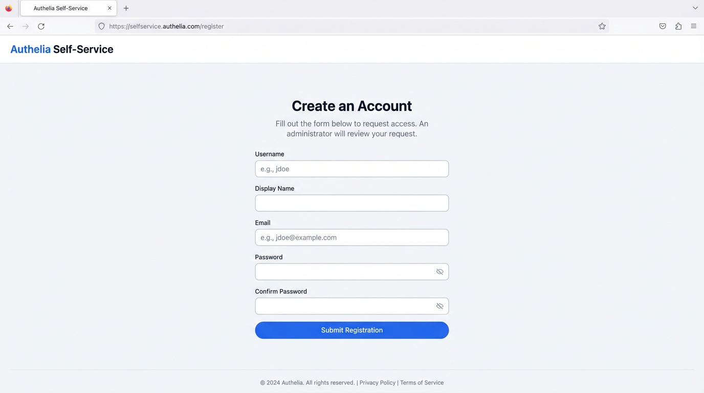
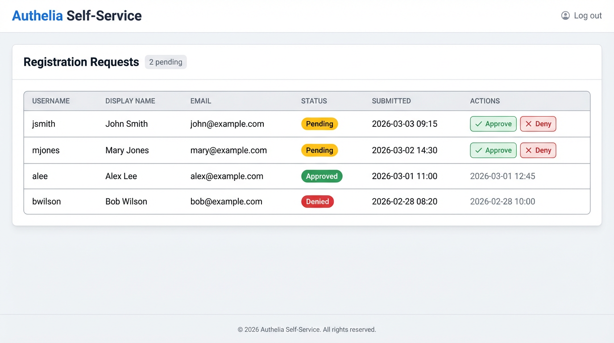

# Authelia Self-Service Registration

A lightweight web app that lets users self-register for Authelia accounts. Registration requests are held for admin approval — the admin is notified by email and can approve or deny from either the email itself or a built-in dashboard.

## Screenshots

### Registration Page


### Admin Dashboard


## How it works

1. A visitor fills out the registration form at `/register`.
2. The password is immediately hashed with argon2id (matching Authelia's default) and stored in a local SQLite database as a **pending** request.
3. The admin receives an email with the request details and one-click **Approve** / **Deny** links.
4. On approval the user is written into Authelia's `users_database.yml` and receives a welcome email.
5. On denial the user receives a notification email.

The admin can also manage all requests from the dashboard at `/admin`.

## Quick start

### 1. Configure

```bash
cp .env.example .env
# Edit .env with your SMTP credentials, admin password, secret key, etc.
```

### 2. Run with Docker Compose

Make sure the volume and network names in `docker-compose.yml` match your existing Authelia setup, then:

```bash
docker compose up -d --build
```

The app will be available at `https://register.example.com` (or whichever domain you configured in the Traefik labels).

### 3. Run locally (development)

```bash
python -m venv .venv
source .venv/bin/activate   # or .venv\Scripts\activate on Windows
pip install -r requirements.txt
uvicorn app.main:app --reload --port 8085
```

## Configuration

All settings are read from environment variables (or a `.env` file).

| Variable | Description | Default |
|---|---|---|
| `SECRET_KEY` | Signs session cookies and email tokens | `change-me-to-a-random-string` |
| `ADMIN_PASSWORD` | Password for the `/admin` dashboard | `change-me` |
| `SMTP_HOST` | SMTP server hostname | `smtp.example.com` |
| `SMTP_PORT` | SMTP server port | `587` |
| `SMTP_USER` | SMTP username | |
| `SMTP_PASSWORD` | SMTP password | |
| `SMTP_STARTTLS` | Use STARTTLS | `true` |
| `ADMIN_EMAIL` | Where approval notifications are sent | `admin@example.com` |
| `FROM_EMAIL` | Sender address for outgoing mail | `noreply@example.com` |
| `AUTHELIA_USERS_FILE` | Path to Authelia's user database YAML | `/data/users_database.yml` |
| `APP_URL` | Public URL of this app (no trailing slash) | `http://localhost:8085` |
| `TOKEN_EXPIRY_HOURS` | How long email approve/deny links are valid | `48` |
| `DEFAULT_GROUPS` | Comma-separated groups for new users | `users` |
| `DATABASE_URL` | SQLite connection string | `sqlite+aiosqlite:///data/registrations.db` |

## Integrating with your Authelia stack

The key requirement is that this app can read and write the same `users_database.yml` file that Authelia uses. In Docker Compose, mount the same volume:

```yaml
volumes:
  - authelia_config:/data
```

After a user is approved, Authelia will pick up the change the next time it reads the file (which happens on each authentication attempt for the file backend).

### Traefik reverse proxy

The included `docker-compose.yml` is pre-configured with Traefik labels to serve the app at `register.example.com`. To adapt it to your setup:

1. **Replace the domain** -- change `register.example.com` in the `Host()` rule to your actual subdomain.
2. **Match your cert resolver** -- update `certresolver=letsencrypt` if your Traefik config uses a different resolver name (e.g. `myresolver`, `le`).
3. **Set `APP_URL`** -- make sure `APP_URL` in your `.env` matches the public URL (e.g. `https://register.yourdomain.com`) so that email approve/deny links point to the right place.
4. **Do NOT apply Authelia middleware** -- this service must remain publicly accessible so unauthenticated users can register. Do not add an `authelia@docker` middleware label.

If you are not using Traefik, remove the `labels` block and add a `ports` mapping instead:

```yaml
ports:
  - "8085:8000"
```

## Security notes

- Passwords are hashed with argon2id before being stored anywhere.
- Email approve/deny links are cryptographically signed and expire after a configurable TTL.
- The registration endpoint is rate-limited to 5 requests per minute per IP.
- The admin dashboard uses a session cookie with `httponly` and `samesite=strict`.
- CSRF tokens protect the registration form.
